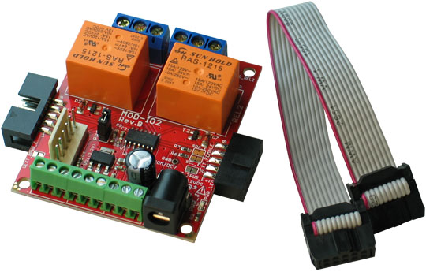

# MOD-IO2

**Input output expandable board with UEXT**

MOD-IO2 is a stackable development board which adds RELAYs and GPIOs to any of our development boards with UEXT.
If you work with any of our development boards with a [UEXT connector](https://www.olimex.com/Products/Modules/UEXT) and you need more GPIOs and/or RELAY outputs, you can add these by connecting MOD-IO2 to your development board.
This board gives you an easy way to interface up to 2 relays and 7 GPIOs.
MOD-IO2 is stackable and addressable, but what does this mean?
These boards can stack together so you can add as many inputs and outputs as you want!
E.g. 2-4-6-8 etc.!
MOD-IO2 has a PIC16F1503 microcontroller and the firmware is available for modification.

[Purchase your MOD-IO2 here!](https://www.olimex.com/Products/Modules/IO/MOD-IO2/open-source-hardware)

## FEATURES

- PIC16F1503 microcontroller
- Pre-loaded open-source firmware for easier interfacing, especially with Linux-enabled boards
- ICSP 6-pin connector for in-circuit programming with PIC-KIT3 or other compatible programmer/debugger.
- 9-pin terminal screw connector for 7 GPIOs, 3.3V and GND
- PWR jack for 12VDC
- 7 GPIOs which could implement different functionality as PWM, SPI, I2C, ANALOG IN/OUT etc.
- 2 relay outputs with 15A/250VAC contacts with screw terminals
- RELAY output status LEDs
- Four mounting holes - 3.3mm ~ (0.13)"
- FR-4, 1.5mm ~ (0.062)", soldermask, white silkscreen component print
- Dimensions 61x52mm ~ (2.4 x 2.05)"

## DOCUMENTS

[MOD-IO2 user manual](doc/MOD-IO2.pdf)

## HARDWARE

- [MOD-IO2 schematic](hardware/MOD-IO2-Rev-B-schematic.pdf)
- [MOD-IO2 schematic and board layout sources for Eagle](hardware/MOD-IO2_brd_sch_eagle)

## SOFTWARE

- [MOD-IO2 firmware version 3.02](software/MOD-IO2_firmware_v_3_02)
- [Linux tool for controlling MOD-IO2](https://github.com/OLIMEX/OLINUXINO/tree/master/SOFTWARE/UEXT%20MODULES/MOD-IO2/linux-access-tool)
- [Arduino IDE library for MOD-IO2 + OLIMEXINO-328](software/OLIMEXINO-328+MOD-IO2)
- [OLIMEXINO-STM32 and MOD-IO2 relay control](software/Olimexino-STM32_MOD-IO2)
- Older firmware, older demo software, customer projects and more at the [wiki page](https://www.olimex.com/wiki/MOD-IO2)

## FAQ

### I found a very nice example of MOD-IO2 connected to another board on the internet. It doesn't work despite using the same setup as the author. What might be different?

There are number of firmware revisions that had been released for MOD-IO2.
You should ensure the example you have found used the same firmware revision of MOD-IO2 as the one you have on the module at the moment.
Each major firmware revision uses a different board address (for firmware revisions 3, 3.1, and 3.02, it is the same - 0x21) AND DIFFERENT PROTOCOL.
Each firmware has a README file inside the source archive that is available for download.
Refer to that README or the user manual for more information about the firmware.

